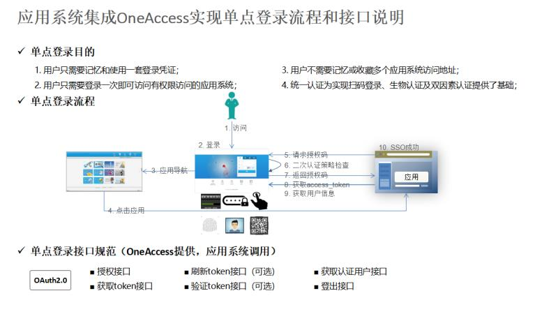
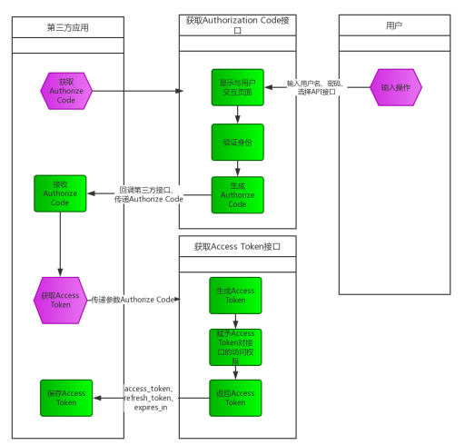

// 生成目录, 在左边
:toc: left
// 四级标题内都会生成目录
:toclevels: 5
// 目录标题
:toc-title: 目录
// 用icon代替文字图标
:icons: font
// 代码高亮
:source-highlighter: pygments
// 生成PDF时的页面大小
:pdf-page-size: A4
// 去除最下面的黑边
:nofooter:
:data-uri:

== 认证中心

=== 客户端

==== SSOToken获取用户信息

基本信息::
接口名称：根据Token获取用户信息 +
接口地址：/sso/getUserInfoByToken +
请求方式：GET +
接口描述： +
该接口用于第三方H5应用获取用户信息，姓名、手机号、登录账号、唯一标识等 +

请求参数::
Headers：

|===
| 参数名称 | 参数值 | 是否必须 | 示例 | 备注

| openAppId
|
| 是
| MiniApp
| 应用ID(由平台提供)

| openSign
|
| 是
| skiew234i3i4o6uy77b4k3b3v2j1vv53j
| 签名(算法参见SDK或者首页说明)

| openTimestamp
|
| 是
| 1602833399813
| 当前时间戳
|===

Query：

|===
| 参数名称 | 是否必须 | 示例 | 备注

| ssoToken
| 是
| MDAwMDkzMDQ3QkQzRkQ0QjcyMThDRjdGMjQw==
| 交换token(1.客户端跳转第三方应用页面会拼在链接后面;2.第三方集成jsSDK获取到的ssoTicket)
|===

返回数据::
响应体结构： +

|===
| 名称 | 类型 | 是否必须 | 默认值 | 备注 | 其他信息

| success
| boolean
| 是
| false
| 调用是否成功 true表示成功, false表示失败
|

| msg
| string
| 是
|
| 返回消息提示
|

| data
| object
| 是
|
| 数据体
|

| code
| int
| 是
| 0
| 状态码 code=200表示接口调用成功,其他标识失败
|
|===

data对象结构： +

|===
| 名称 | 类型 | 是否必须 | 默认值 | 备注 | 其他信息

| name
| string
| 是
|
| 用户姓名
|

| mobile
| string
| 是
|
| 用户手机号
|

| uid
| int
| 是
|
| 用户唯一标识
|

| account
| string
| 是
|
| 用户登录账号
|
|===

`成功响应数据样例:`

[source,json]
....
{
    "code": 200,
    "msg": "",
    "success": true,
    "data": {
        "name": "张三",
        "mobile": "14000000000",
        "uid": 123456987,
        "account": "zhangsan"
    }
}
....

`失败响应数据样例:`

[source,json]
....
{
    "code": 500,
    "msg": "token过期",
    "success": false,
    "data": null
}
....

=== PC端

    PC跳转第三方应用采用OAuth2.0标准

==== OAuth介绍

    OAuth是一个关于授权的开放的网络协议，在第三方应用与服务提供商之间设置一个授权层。第三方应用不能直接登录服务提供商，只能登录授权层，以此将用户与客户端区分开来。第三方应用登录授权层所用的令牌，与用户的密码不同。用户可以在登录授权的时候，指定授权层令牌的权限范围和有效期。第三方应用登录授权层以后，服务提供商根据令牌的权限范围和有效期，向第三方应用开放用户资源。

==== OAuth流程

==== 应用授权

基本信息::
接口名称：应用授权 +
接口地址：https://{host}:{port}/oauth2/authorize +
请求方式：GET +
接口描述： +
此接口是浏览器redirect跳转方式调用； +
如果用户已完成过登录，访问此地址则会直接跳转到指定的回调地址，带上code。如果请求参数中传入了state，这里会带上原始的state值； +
如果用户未登录，访问此地址会跳转至登录页面，显示应用配置的认证方式，用户完成登录后跳转到指定的回调地址，带上code。如果请求参数中传入了state，这里会带上原始的state值。

请求参数::
Query：

|===
| 参数名称 | 是否必须 | 示例 | 备注

| redirectUrl
| 是
| http://{host}:{port}/apphub/oauth/callback
| 跳转地址(url编码需要encode)

| appId
| 是
| MiniApp
| 应用ID(由平台提供)

| state
| 是
| 任意值(随机数)
| 用于保持请求和回调的状态，在回调时，会在Query Parameter中回传该参数。开发者可以用这个参数验证请求有效性，也可以记录用户请求授权页前的位置。这个参数可用于防止跨站请求伪造（CSRF）攻击
|===

返回数据::
参数正确登录成功时，会跳转到回调地址： +
以上文中的回调地址为例，完成后会跳转至http://{host}:{port}/apphub/oauth/callback?code=ae1838f40638e218bc90a92df3091793&state=xxxxx，携带参数code和state。

==== 获取AccessToken

基本信息::
接口名称：获取访问Token +
接口地址：/oauth2/getTokenByCode +
请求方式：GET +
接口描述： +
该接口可以获得accessToken +

请求参数::
Headers：

|===
| 参数名称 | 参数值 | 是否必须 | 示例 | 备注

| Content-Type
| application/json
| 是
|
|

| openAppId
|
| 是
| MiniApp
| 应用ID(由平台提供)

| openSign
|
| 是
| skiew234i3i4o6uy77b4k3b3v2j1vv53j
| 签名(算法参见SDK或者首页说明)

| openTimestamp
|
| 是
| 1602833399813
| 当前时间戳
|===

Query：

|===
| 参数名称 | 是否必须 | 示例 | 备注

| code
| 是
| iewoer233422i34o2i34uio55iojhg6g
| 授权码(调用授权接口获得的授权码code)
|===

返回数据::
响应体结构： +

|===
| 名称 | 类型 | 是否必须 | 默认值 | 备注 | 其他信息

| success
| boolean
| 是
| false
| 调用是否成功 true表示成功, false表示失败
|

| msg
| string
| 是
|
| 返回消息提示
|

| data
| string
| 是
|
| 访问Token，用于交换用户信息
|

| code
| int
| 是
| 0
| 状态码 code=200表示接口调用成功,其他标识失败
|
|===

`成功响应数据样例:`

[source,json]
....
{
    "code": 200,
    "msg": "",
    "success": true,
    "data": "MDAwMDkzMDQ3QkQzRkQ0QjcyMThDRjdGMjQw=="
}
....

`失败响应数据样例:`

[source,json]
....
{
    "code": 500,
    "msg": "appId错误",
    "success": false,
    "data": null
}
....

==== AccessToken获取用户信息

基本信息::
接口名称：根据访问Token获取用户信息 +
接口地址：/oauth2/getUserInfoByToken +
请求方式：GET +
接口描述： +
该接口用于第三方应用获取用户信息，姓名、手机号、登录账号、唯一标识等 +

请求参数::
Headers：

|===
| 参数名称 | 参数值 | 是否必须 | 示例 | 备注

| openAppId
|
| 是
| MiniApp
| 应用ID(由平台提供)

| openSign
|
| 是
| skiew234i3i4o6uy77b4k3b3v2j1vv53j
| 签名(算法参见SDK或者首页说明)

| openTimestamp
|
| 是
| 1602833399813
| 当前时间戳
|===

Query：

|===
| 参数名称 | 是否必须 | 示例 | 备注

| accessToken
| 否
| MDAwMDkzMDQ3QkQzRkQ0QjcyMThDRjdGMjQw==
| 访问token(调用获取token接口获取到的accessToken)
|===

返回数据::
响应体结构： +

|===
| 名称 | 类型 | 是否必须 | 默认值 | 备注 | 其他信息

| success
| boolean
| 是
| false
| 调用是否成功 true表示成功, false表示失败
|

| msg
| string
| 是
|
| 返回消息提示
|

| data
| object
| 是
|
| 数据体
|

| code
| int
| 是
| 0
| 状态码 code=200表示接口调用成功,其他标识失败
|
|===

data对象结构： +

|===
| 名称 | 类型 | 是否必须 | 默认值 | 备注 | 其他信息

| name
| string
| 是
|
| 用户姓名
|

| mobile
| string
| 是
|
| 用户手机号
|

| uid
| int
| 是
|
| 用户唯一标识
|

| account
| string
| 是
|
| 用户登录账号
|
|===

`成功响应数据样例:`

[source,json]
....
{
    "code": 200,
    "msg": "",
    "success": true,
    "data": {
        "name": "张三",
        "mobile": "14000000000",
        "uid": 123456987,
        "account": "zhangsan"
    }
}
....

`失败响应数据样例:`

[source,json]
....
{
    "code": 500,
    "msg": "token过期",
    "success": false,
    "data": null
}
....

==== 返回码参考

|===
| 返回玛 | 说明

| 200
| 成功

| 500
| 异常(具体错误见msg字段)
|===

