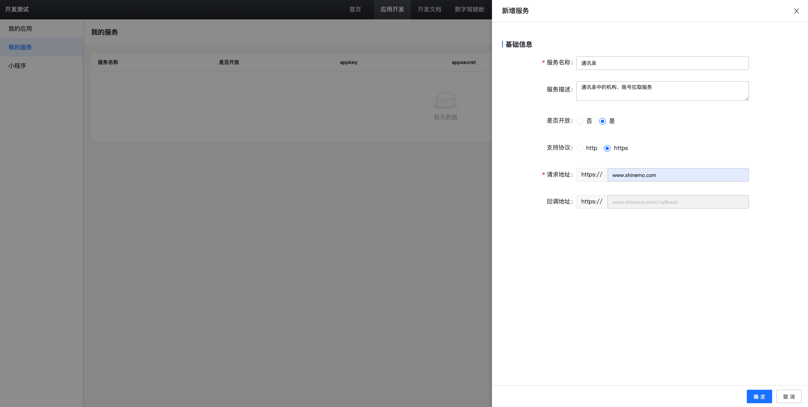
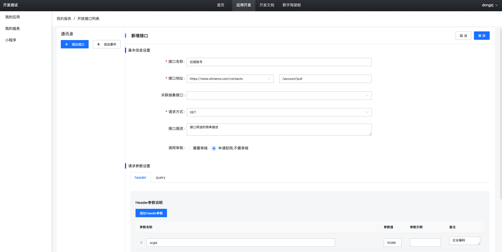
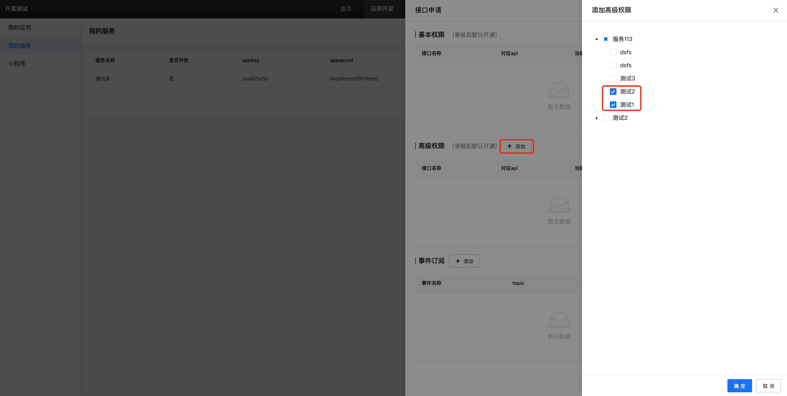
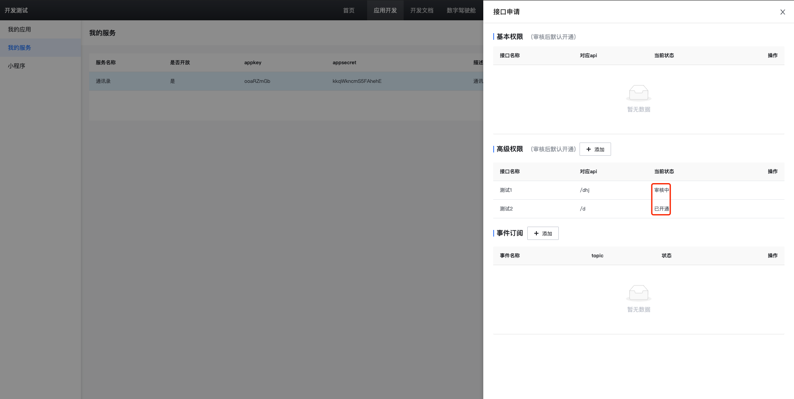
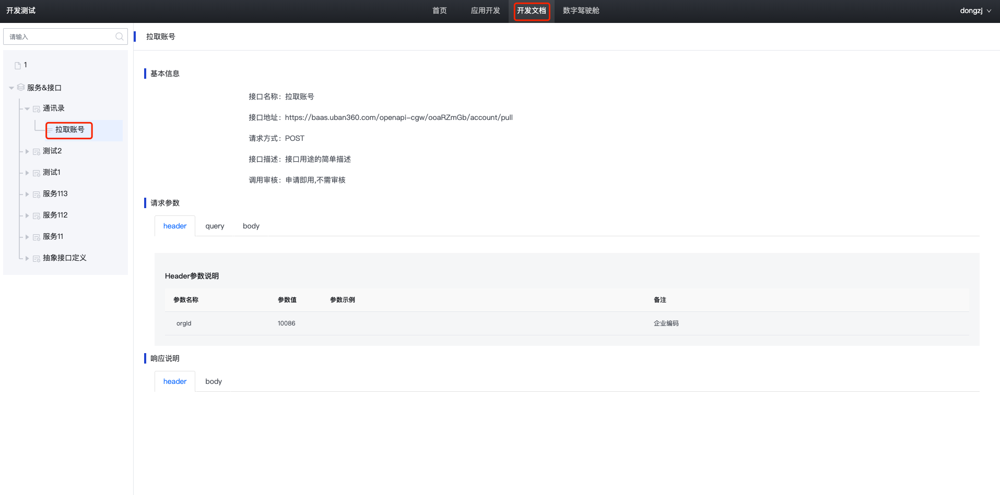

== 概述说明
  开放平台是讯盟提供给开发者服务注册、接口发布的平台，致力于简化不同系统间的服务调用。

=== 服务注册

|===
| 字段 | 说明

| 服务名称
| 注册的服务名称

| 服务描述
| 对服务的简单描述

| 是否开放
|服务如果开放，则可以开放接口供其他系统调用；否则只能申请其他系统的接口调用

| 支持协议
| 目前只支持Http/Https两种协议

| 请求地址
| 服务所在的地址信息，可以为域名，也可以为IP:PORT
|===

`说明` +
不同系统在相互调用接口之前，需要在开放平台注册服务，平台会自动为该服务创建appId、appSecret,请务必保管好这两个参数，以免泄露。

=== 开放接口列表

|===
| 字段 | 说明

| 接口名称
| 开放接口的名称

| 接口地址
| 接口的基础路径会自动生成，只需填写对应Controller中的请求路径

| 关联抽象接口
| 管理员可以创建一些抽象接口，来规范请求的Request和Response

| 请求方式
| POST/GET

| 接口描述
| 对接口的简单描述

| 调用审核
| 接口是否需要管理员审核通过后才能发起调用

| 请求参数设置
| 设置Request的Header/Query/Body参数

| 返回参数设置
| 设置Response的Header/Body参数
|===

`说明` +
调用审核，如果设置为免审核，则在申请接口时，自动开通；如果设置为需要审核，则该接口需要管理员审核通过后才可以使用；

=== 申请接口列表

`说明` +
点击接口申请，在对应的服务列表中找到需要调用的接口，点击确定。如果该接口不需要审核，则申请列表中的状态显示为已开通；如果需要审核，当前状态为审核中，管理员可以通过、拒绝该申请。

=== 开发文档

`说明` +
系统自动为每个服务和接口创建对应的文档信息，点击某个接口可以查看到接口的详情。其中的接口地址会自动根据当前环境的域名进行切换。
接口地址规则：${域名}/${网关地址}/${appId}/${接口地址}

=== 接口权限
  不同系统间的接口调用统一通过开放平台网关服务进行鉴权、转发。

=== 接口签名

调用开放平台开放的接口，header要带上三个字段：

[width="100%",cols="18%,82%",options="header",]
|===
|字段名 |字段值
|openTimestamp |timestamp

|openAppId |appkey

|openSign |1、先对appKey + timestamp + bodyLength的内容sha256加密，得到一个十六进制字符串sign; +
           2、再对上一步的sign+appSecret做md5加密，将加密结果转为十六进制字符串openSign +

|===

关键信息说明：

* timestamp：系统时间戳
* appkey、appsecret：开放平台上注册服务时生成
* bodyLength: 请求体转成json串后的字节数组长度
（获取字节数组时，请使用"utf-8"编码）

接口签名 - java示例

[source,java]
----
public class BaseConfig {
    // int bodyLength = JsonUtils.toJson(param).getBytes("utf-8").length;
    public Map<String, Object> getHeaders(int bodyLength) {
        Map<String, Object> headers = new HashMap();
        long timestamp = System.currentTimeMillis();
        headers.put("openTimestamp", String.valueOf(timestamp));
        headers.put("openAppId", this.appId);
        String content = this.appId + timestamp + bodyLength;
        headers.put("openSign", SignUtils.generate(content, this.appSecret));
        return headers;
    }
}
----

[source,java]
----
public class SignUtils {
    public static String generate(String content, String secret) {
        String sign = EncryptUtils.sha256(content);
        sign = EncryptUtils.md5Hex(sign + secret);
        return sign;
    }
}
----

[source,java]
----
public class EncryptUtils {
    private final static char[] HEX_DIGITS = {'0', '1', '2', '3', '4', '5', '6', '7', '8', '9', 'a', 'b', 'c', 'd', 'e', 'f'};

    /**
     * 32位 MD5加密
     *
     * @param s
     * @return
     */
    public static String md5Hex(String s) {
        byte[] result = digest("MD5", s.getBytes(UTF_8));
        return hex(result);
    }

    /**
     * 32 位 sha256加密
     *
     * @param s
     * @return
     */
    public static String sha256(String s) {
        byte[] result = digest("SHA-256", s.getBytes(UTF_8));
        return hex(result);
    }

    private static byte[] digest(String algorithm, byte[] data) {
        try {
            MessageDigest digest = MessageDigest.getInstance(algorithm);
            digest.update(data, 0, data.length);
            return digest.digest();
        } catch (NoSuchAlgorithmException e) {
            throw new ApiException(algorithm + " error", e);
        }
    }

    private static String hex(byte[] data) {
        char[] result = new char[data.length * 2];
        int c = 0;
        for (byte b : data) {
            result[c++] = HEX_DIGITS[(b >> 4) & 0xf];
            result[c++] = HEX_DIGITS[b & 0xf];
        }
        return new String(result);
    }
}
----